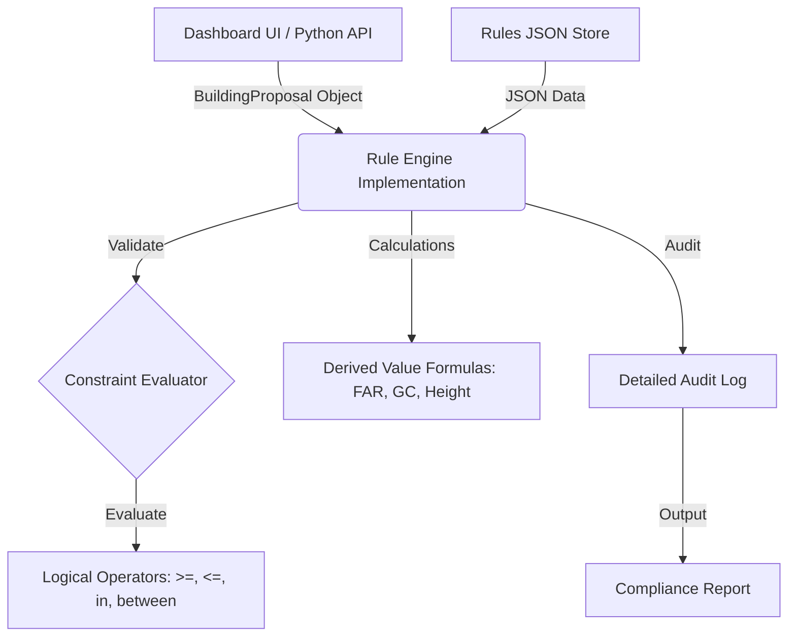

# 📐 Rule_Engine_Architecture_and_Design.md

## 🧱 Design Philosophy
The UP Bylaw Rule Engine is built on a **Data-Driven Architecture**. Instead of hardcoding complex municipal laws into IF-ELSE statements, we separate the **Engine Logic** (The "How") from the **Rules Data** (The "What").

### Why this approach?
1.  **Transparency**: Planners can audit the JSON rules without knowing JavaScript.
2.  **Maintainability**: Bylaws change annually; the engine code remains static while only the JSON is updated.
3.  **Scalability**: A new jurisdiction (e.g., Delhi/Mumbai) can be added by simply loading a different JSON data file.

---

## 🏛️ System Architecture



---

## 📊 Data Structures

### 1. The BuildingProposal
This is the input to the engine. It contains the raw and derived parameters of the plot and the proposed building.
```json
{
  "building_type": "single_unit",
  "plotArea": 450,
  "primaryRoadWidth": 9.0,
  "proposedHeight": 12.5,
  "totalFloorArea": 800
}
```

### 2. The Rule Structure
Each rule in the `rules` array is a structured object:
Field | Purpose
---|---
`rule_id` | Unique identifier (e.g., FAR-001).
`condition` | When this rule applies (e.g., "if building_type == single_unit AND area <= 100").
`parameter` | The field being constrained (e.g., "FAR").
`operator` | The constraint logic (e.g., "<=").
`value` | The threshold value (e.g., 1.5).
`severity` | `error` (Illegal), `warning` (Needs approval), or `info` (Guideline).

---

## ⚙️ Evaluation Pipeline

1.  **Enrichment**: The engine calculates derived fields (e.g., calculating FAR if only PlotArea and BuiltUpArea are provided).
2.  **Filtering**: The engine identifies which rules are "applicable" based on `building_type` and `condition`.
3.  **Constraint Checking**: For each applicable rule, the engine compares the `actual` value vs the `required` value.
4.  **Reporting**: Results are aggregated into `passed`, `errors`, and `warnings`.

---

## 📈 Extensibility Patterns

### Custom Formulas
The engine supports a `calculations` block where complex formulas (like "netPlotArea after widening") are defined. Developers can easily add new compute heads to the `calculateDerivedValues` function.

### Multi-Jurisdiction
The `_meta` block in the JSON identifies the authority. The system can support switching between `UP_BYLAWS` and `MOI_BYLAWS` at runtime.

### Permissibility Matrix
Beyond numerical constraints, the engine includes a `permissibility_matrix` to check if a "School" is even allowed in a "Residential Zone".
