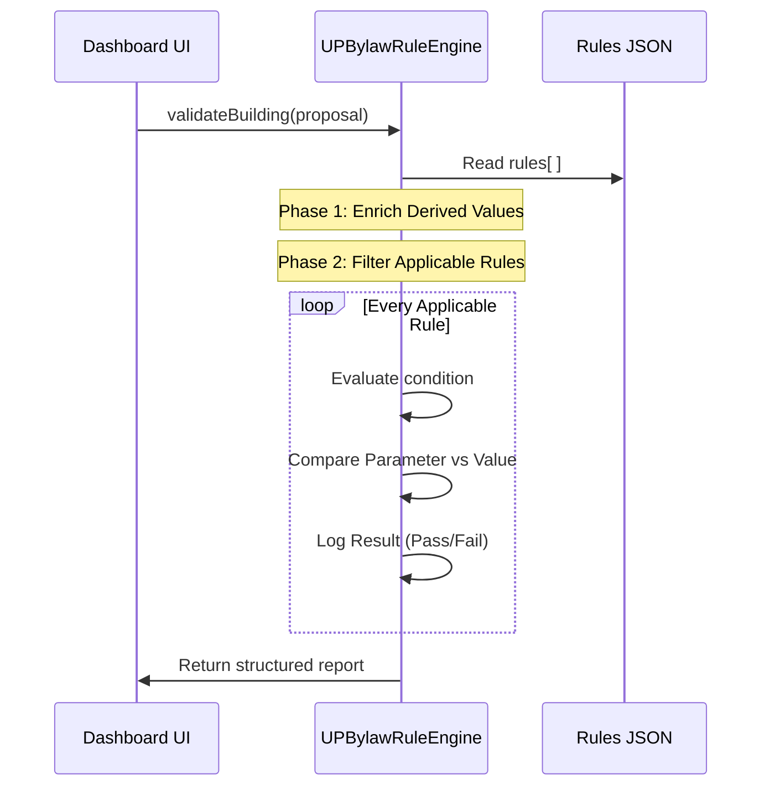
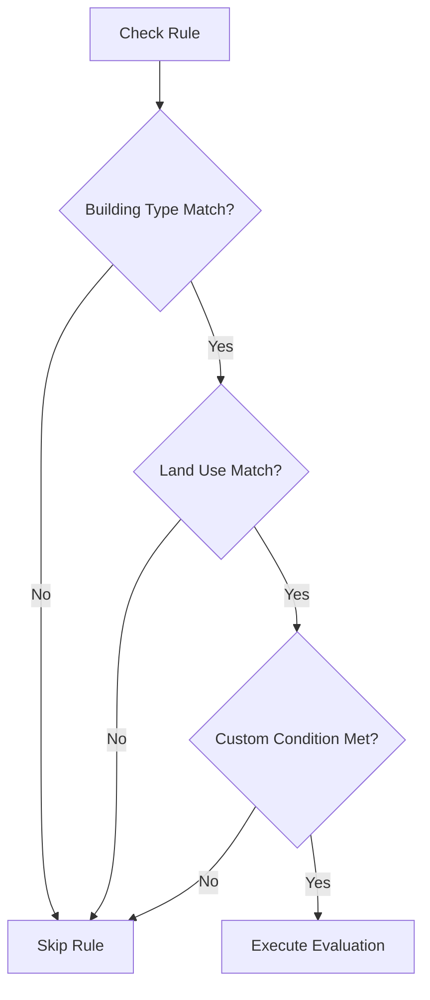

# 🖼️ Visual_Workflow_Guide.md

This document provides visual representations of the UP Bylaw Rule Engine's internal logic and processing sequence.

## 1. High-Level System Flow
The engine behaves as a pure function: Input (Proposal + Rules) → Output (Report).

---

## 2. Rule Applicability Logic (Filter)
Before a rule is "executed", the engine checks if it applies to your building.

---

## 3. The "Solar-Zoning" Integration
How the rule engine interacts with the zoning engine logic.

---

## 4. Derived Value Dependencies
The engine "frightens" the data by calculating missing pieces automatically.

| Input Parameter | → | Derived Result | Formula |
|---|---|---|---|
| plotArea, proposedHeight | → | numberOfStoreys | `ceil(height / 3.5)` |
| footprintArea, plotArea | → | groundCoverage | `(fp / plot) * 100` |
| totalFloorArea, plotArea | → | FAR | `total / plot` |
| roads[ ] | → | primaryRoadWidth | `max(roads.width)` |
